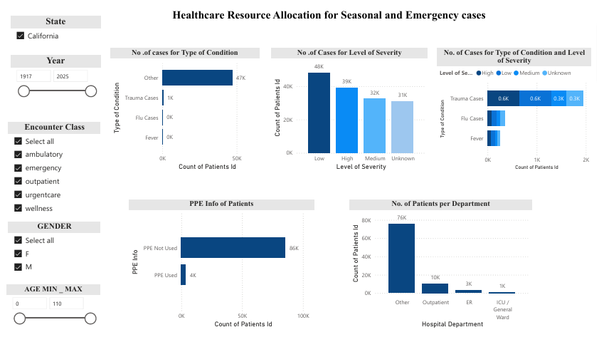
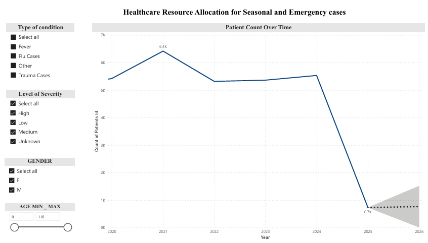

Healthcare Resource Allocation for Seasonal and Emergency Cases

## Project Overview

Healthcare organizations frequently face challenges in allocating resources efficiently during periods of fluctuating patient demand caused by seasonal illnesses and emergency medical cases. Inadequate planning can result in shortages of hospital beds, medical staff, and critical equipment, negatively affecting patient outcomes and increasing operational strain.

This project develops a healthcare analytics and decision-support solution that leverages synthetic Electronic Health Records (EHRs) generated through Synthea to forecast patient demand and support healthcare resource allocation for seasonal and emergency medical conditions. The solution enables hospital administrators to anticipate demand, prepare for healthcare surges, and optimize the allocation of beds, staff, and critical equipment through interactive dashboards and forecasting analytics.

## Problem Statement

Hospitals often struggle to anticipate resource requirements for:

* Seasonal illnesses (Flu, Fever, RSV, Pneumonia, Asthma, Allergies, etc.)
* Emergency and trauma-related cases
* Variations in patient severity levels
* Changes in demand across age groups and gender demographics

Without accurate forecasting, healthcare facilities risk:

* Bed shortages
* Staff shortages
* Equipment shortages
* Increased patient wait times
* Reduced quality of care

This project addresses these challenges by providing data-driven forecasting and resource allocation insights to support proactive healthcare planning.

## Target Audience

### Primary Users: Hospital Administrators

The dashboard supports hospital administrators by helping them:

* Monitor healthcare resource utilization
* Forecast future patient volumes
* Allocate beds and staff efficiently
* Prepare for seasonal healthcare demand
* Improve emergency readiness and surge planning
* Optimize critical resource allocation

## Key Achievements

* Forecasted patient volumes for seasonal and emergency medical conditions using Synthea-generated EHR data.
* Developed three interactive Power BI dashboard pages for resource allocation, severity analysis, and patient forecasting.
* Applied Power BI's built-in segmented univariate time-series forecasting with 95% confidence intervals.
* Analyzed 10,000+ synthetic healthcare records across Patients, Conditions, Encounters, Procedures, Medications, Observations, and Supplies datasets.
* Categorized healthcare conditions and severity levels to support targeted resource allocation planning.
* Enabled hospital administrators to explore patient demand trends using dynamic filters for age, gender, severity, and condition type.
* Created a decision-support solution for forecasting healthcare demand and improving resource planning readiness.

## Tools & Technologies

| Technology   | Purpose                                                      |
| ------------ | ------------------------------------------------------------ |
| SQL (SQLite) | Data extraction, transformation, validation, and aggregation |
| Power BI     | Dashboard development, visualization, and forecasting        |
| Synthea      | Synthetic Electronic Health Record (EHR) generation          |

## Project Structure

MRP/
│
├── Images/
│   ├── MRP (Power BI) - 1.png
│   ├── MRP (Power BI) - 2.png
│   └── MRP (Power BI) - 3.png
│
├── Power_BI/
│   └── MRP.pbix
│
├── SQL/
│   ├── SQLite -1.sql
│   └── SQLite -2.sql
│
├── README.md
└── .gitignore

## Data Source

This project uses synthetic Electronic Health Records (EHRs) generated using the Synthea healthcare simulation platform.

Source:

https://synthea.mitre.org/

### Dataset Includes

* Patient Demographics
* Encounters
* Conditions
* Procedures
* Medications
* Observations
* Providers
* Organizations
* Claims Information
* Supplies

The synthetic dataset was used to simulate healthcare demand patterns for seasonal illnesses and emergency medical conditions while preserving patient privacy.

> Note: Raw datasets and database files are excluded from this repository due to GitHub file-size limitations.

## 🗄 SQL Data Preparation & Analysis

SQL was used extensively for healthcare data extraction, transformation, and validation prior to dashboard development.

### Key SQL Activities

* Joined patient, encounter, condition, medication, procedure, and observation datasets.
* Created aggregated datasets for reporting and analysis.
* Categorized medical conditions into seasonal illness and trauma-related groups.
* Supported severity-level classification (Low, Medium, High).
* Validated patient counts and healthcare utilization metrics.
* Prepared datasets for dashboard reporting and forecasting.

## Dashboard Features

### Dashboard Page 1: Resource Allocation Dashboard

Provides a comprehensive overview of healthcare resource utilization.

#### Key Metrics

* Total Cases
* Beds Occupied
* Staff Availability
* Ventilator Utilization
* ICU Bed Utilization
* Department-wise Resource Consumption
* Condition-wise Resource Allocation

#### Purpose

Helps hospital administrators understand current resource consumption patterns and identify high-demand healthcare areas.

### Dashboard Page 2: Severity Analysis Dashboard

Analyzes patient demand across severity categories.

#### Key Features

* High Severity Analysis
* Medium Severity Analysis
* Low Severity Analysis
* Unknown Severity Classification
* Department Utilization Breakdown
* PPE Usage Analysis
* Patient Distribution by Severity

#### Purpose

Supports prioritization of healthcare resources toward high-risk patient populations.

### Dashboard Page 3: Patient Forecasting Dashboard

Forecasts future patient demand to support proactive planning and resource allocation.

#### Interactive Filters

* Condition Type
* Severity Level
* Gender
* Age Group

#### Purpose

Allows hospital administrators to forecast demand for specific patient populations and healthcare scenarios.

## Forecasting Methodology

### Segmented Univariate Time Series Forecasting

The forecasting model uses Power BI's built-in forecasting functionality to predict future patient volumes.

### Approach

* Forecasts patient counts over time.
* Uses historical patient demand patterns.
* Forecasts a single variable (patient count) over a time dimension.
* Dynamically segmented using slicers and filters.

### Forecast Segments

* Condition Type
* Severity Level
* Gender
* Age Group

### Example Scenarios

* High-severity flu cases among elderly patients.
* RSV-related admissions.
* Trauma cases resulting from accidents.
* Gunshot-related emergency admissions.
* Condition-specific healthcare surge planning.

### Why This Approach?

Hospital administrators rarely need forecasts for all patients combined. Instead, they require forecasts for specific patient populations to improve staffing, bed allocation, and equipment planning.

## Forecast Interpretation

Example:

| Metric      | Value        |
| ----------- | ------------ |
| Forecast    | 120 Patients |
| Lower Bound | 90 Patients  |
| Upper Bound | 150 Patients |

### Interpretation

Based on historical trends, approximately 120 patients are expected during the forecast period. Actual patient volume may reasonably range between 90 and 150 patients.

This uncertainty range enables administrators to create contingency plans and allocate resources proactively.

## Dashboard Screenshots

### Resource Allocation Dashboard

### Severity Analysis Dashboard

### Patient Forecasting Dashboard

## Key Insights

### Resource Utilization

* Resource consumption varies across condition categories.
* Trauma-related cases typically require greater resource utilization than seasonal illnesses.
* ICU and ventilator usage are concentrated among high-severity patients.

### Severity Trends

* High-severity and medium-severity cases contribute substantially to healthcare demand.
* Severity segmentation helps prioritize critical resource allocation.

### Forecasting Insights

* Future patient demand can be anticipated using historical trends.
* Seasonal and emergency healthcare surges can be identified proactively.
* Resource shortages can be anticipated and planned for in advance.

## Business Impact

The solution provides a decision-support framework for hospital administrators by:

* Forecasting future patient demand for seasonal and emergency medical conditions.
* Supporting proactive allocation of beds, staff, ventilators, and critical resources.
* Enabling healthcare surge preparedness through scenario-based planning.
* Identifying high-demand patient populations through severity, age, and gender segmentation.
* Improving operational readiness and resource planning.
* Supporting informed healthcare decision-making through data-driven insights.

## Future Enhancements

Potential future improvements include:

* Machine Learning-based forecasting models
* Real-time EHR integration
* Resource optimization recommendations
* Geographic demand forecasting
* Emergency event simulation
* Predictive staffing optimization
